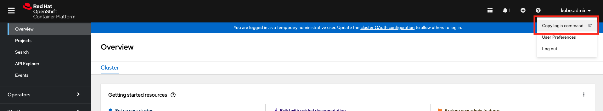
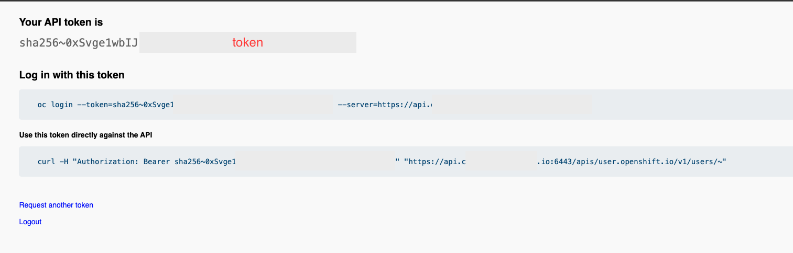

# OCP scale automation with Ansible

## 1. Description

All this code permits you to scale an existing OCP cluster on Nutanix AOS automatically with Ansible. You have the possibility to set your parameters to adapt your cluster to your needs (number of nodes, cpu, memory, disk, etc...).

## 2. What this automation do

* Scale your existing OCP cluster whit x new OCP worker nodes as requested by the user.

This automation follow official documentation : [OCP cluster scale](https://docs.openshift.com/container-platform/4.9/post_installation_configuration/node-tasks.html)

**Note :** Today, this automation permit only to have worker nodes with dynamic IPs provided by Nutanix AOS IPAM (DHCP).

## 3. Prerequisites

- [ ] Your environment have Internet access
- [ ] Nutanix AOS cluster with admin access
- [ ] A Nutanix AOS subnet with IPAM enable
- [ ] Your cluster was provisioned by the automation in ocp_install directory of this repository
- [ ] Red Hat account with valid subscription (RHEL, AAP, OCP)
	- RHEL8 BaseOS repo : rhel-8-for-x86_64-baseos-rpms
	- RHEL8 AppStream repo : rhel-8-for-x86_64-appstream-rpms
	- AAP2 repo : ansible-automation-platform-2.1-for-rhel-8-x86_64-rpms
- [ ] QCOW2 images imported on Nutanix AHV cluster :
	- RHCOS OpenStack image (ex: https://mirror.openshift.com/pub/openshift-v4/dependencies/rhcos/4.9/latest/rhcos-4.9.0-x86_64-openstack.x86_64.qcow2.gz)
- [ ] Ansible Execution Environment : ocp_nuta (quay.io/david_martini/ocp_nuta:1.1)
- [ ] One VM bastion used to deploy automation with :
	- RHEL8
	- podman
	- ansible-navigator
	- Ansible Execution Environment with all tools needed by this automation scripts
- [ ] A defined IP for your infravm (ex: 192.168.40.10). This server have a major role during deployment (DNS server & LB) and this IP is very important. This IP can be outside of the DHCP scope to haven't clash IP.
- [ ] A OCP admin token
	

## 4. Deployment

All steps must be done on your RHEL8 VM Bastion or your RHEL8 workstation connected to the Internet (to pull image) with direct access to your Nutanix cluster. 

✅ **Please read the entire documentation step by step to deploy without error**

**1. Register your RHEL8 VM Bastion**
```
subscription-manager register
```

**2. Attach a subsciption to your RHEL8 VM Bastion**
```
subscription-manager attach --pool=<your pool ID>
```

**3. Enable needed repos on RHEL8 VM Bastion**
```
subscription-manager repos --enable=rhel-8-for-x86_64-baseos-rpms \
--enable=rhel-8-for-x86_64-appstream-rpms \
--enable=ansible-automation-platform-2.1-for-rhel-8-x86_64-rpms \
```

**4. Install tools and utilities on RHEL8 VM Bastion**
```
dnf install git vim bind-utils jq podman ansible-navigator
```

**5. Pull Ansible EE with all embedded tools on your RHEL8 VM Bastion**
```
podman pull quay.io/david_martini/ocp_nuta:1.1
```

**6. Clone GIT repository on your RHEL8 VM Bastion**
```
git clone https://github.com/davmartini/rh_nutanix_fr.git
```

**7. Get your admin token**

OCP Console > user on the top right windows > Copy login command





**7. Go to GIT workspace and edit vars file with your configuration**
```
cd $PATH/rh_nutanix_fr/ocp_scale/
vim ansible/vars/vars.yaml
```

**8. Add infravm IP you chosen as DNS server on your Nutanix AHV network where you deploy your OCP cluster throught Prism interface. This IP must be the IP DNS server for the subnet**
```
Prism > Network & Security > Subnets > Select your network > Actions > Update
```

With this configuration, OCP nodes will request to infravm to resolve your cluster DNS records and install properly all needed.

**9. Custom DNS on VM Bastion**

All the automation is embedded in a container and your don't need to install extra tools directly on your bastion. Howerver, this container or Execution Environment need to resolv OCP cluster records to install properly it.

The container or Execution Environment inherite of DNS configuration you have on your Bastion. Before to start the deployment you must so add the infravm IP as **first** DNS server as follow :

```
# Generated by NetworkManager
search nutarh.io
nameserver ${infravmip}
nameserver 10.42.32.10
nameserver 10.42.32.11
```


**10. Scale your cluster with Ansible**
> :heavy_exclamation_mark: Before you scale your cluster, be sure your have configured infravm IP as first DNS server in IPAM configuration of your AOS subnet.
```
ansible-navigator run ansible/main.yml --eei quay.io/david_martini/ocp_nuta:1.1 -m stdout --pae false --lf /tmp/ansible-navigator.log
```


## 5. Access to your custer
You can access to you fresh installed cluster from your remote computer to define infravm IP as DNS server. You can also follow this steps bellow if you are on mac.

* Create direcotry as root on your mac
```
sudo mkdir /etc/resolver/
```

* Create domain file where ${domain} is the domain you chosen during OCP deployment and ${infravmip} is the infravm IP you chosen.
```
sudo bash -c 'echo "nameserver ${infravmip}" > /etc/resolver/${domain}'
example :
sudo bash -c 'echo "nameserver 192.168.40.10" > /etc/resolver/domain.io'
```

* Verify your new DNS configuration on your computer
```
scutil --dns 
---
resolver #11
  domain   : domain.io
  nameserver[0] : 192.168.40.10
  flags    : Request A records, Request AAAA records
  reach    : 0x00000002 (Reachable)
---
```
All DNS requests concerning the domain **domain.io** will be forwarded to **192.168.40.10** DNS server 
